# Open-PictoPull

PictoPull is a puzzle game released on [Steam](https://store.steampowered.com/app/1820790/PictoPull/) and [Switch](https://www.nintendo.com/us/store/products/pictopull-switch/) in 2023. It was developed in the Unity Engine by Joseph Feldmann under the Screen Smith Studios LLC. The Switch port was handled by [Bearded Ants](https://www.beardedants.com/). The game is heavily inspired by the [Pushmo](https://en.wikipedia.org/wiki/Pushmo) and [Crashmo](https://en.wikipedia.org/wiki/Crashmo) puzzle games by Nintendo. The Steam version of the game has 150 puzzles + a full level editor with Steam workshop support so users can create and share their own levels. 

Development was started on a sequel to PictoPull, called PictoFall, which would have been a similar style game focused on a new type of level called "Crash Levels". These are based on the puzzles found in Crashmo. The sequel was abandoned as I (Joseph Feldmann) lost interest and wanted to work on other projects instead. Instead of releasing a sequel I am open sourcing the project as much as I can so that others can experiment with it or create a sequel themselves. This open source version of PictoPull will be referred to as Open-PictoPull and has some differences from the full version for legal reasons

# About The Game

Levels in PictoPull are made via a built in level editor. You draw pixel art and then the game converts that pixel art into a 3D block puzzle. The player solves the puzzles by taking control of a third person character that pushes and pulls on those 3D blocks in order to climb up them and reach a goal. Levels are generated and stored in the JSON file format.

<table width="100%">
<tr><th style="text-align:center">Level Editor</th><th style="text-align:center">In Level</th></tr>
<tr><td>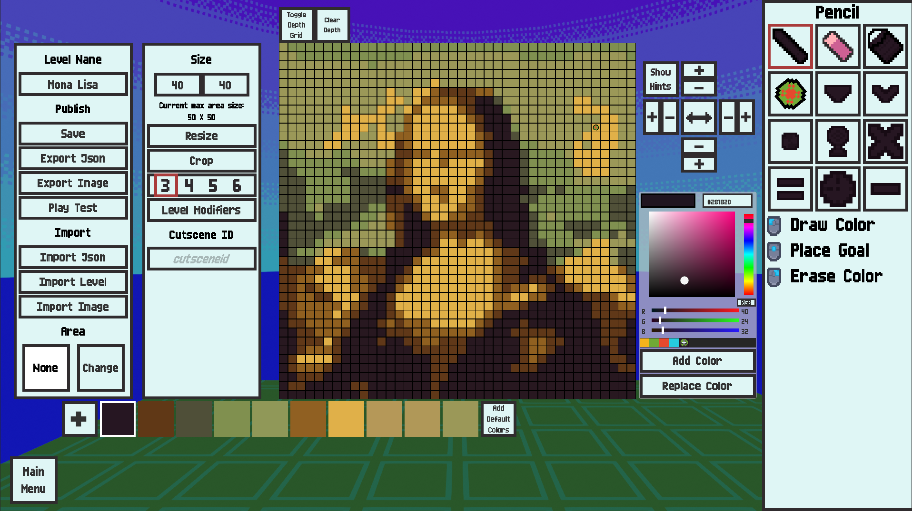</td><td>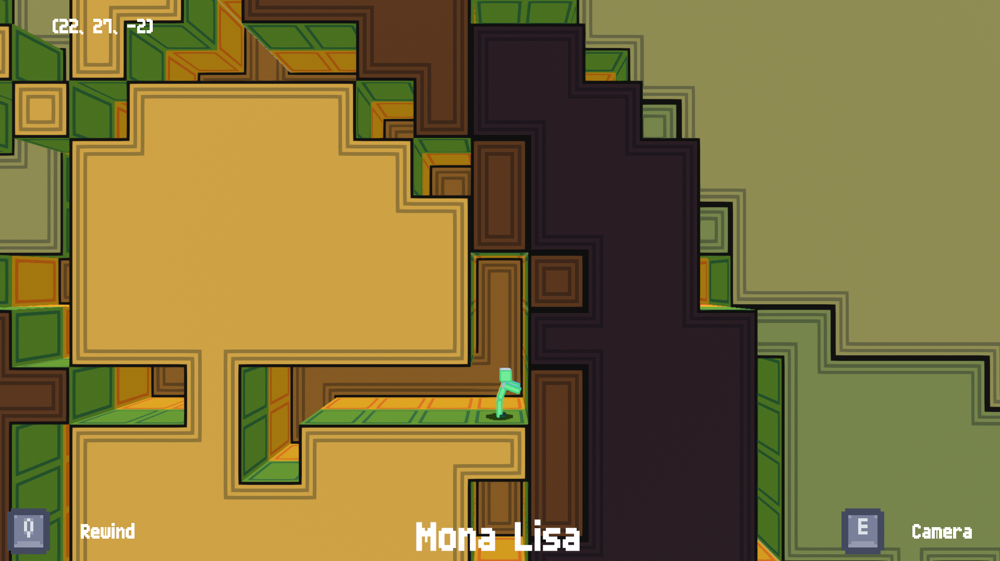</td></tr>
</table>

The game contains Three types of levels:

<table width="100%" >
<tr >
<th style="text-align:center">Pull Levels</th>
<th style="text-align:center">2D Crash Levels</th>
<th style="text-align:center">3D Crash Levels</th>
</tr>

<tr>
<td>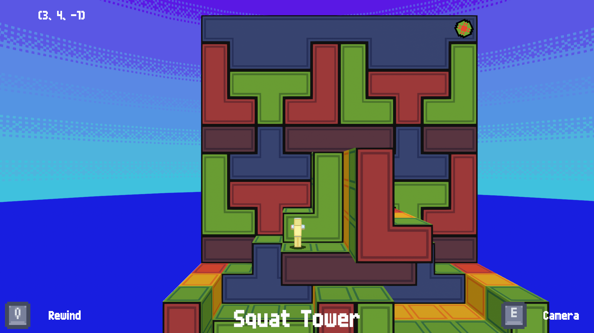</td>
<td style="border-left:2px solid">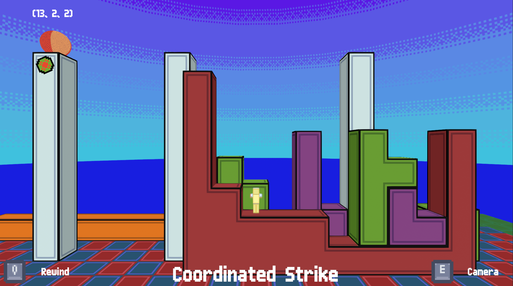</td>
<td style="border-left:2px solid">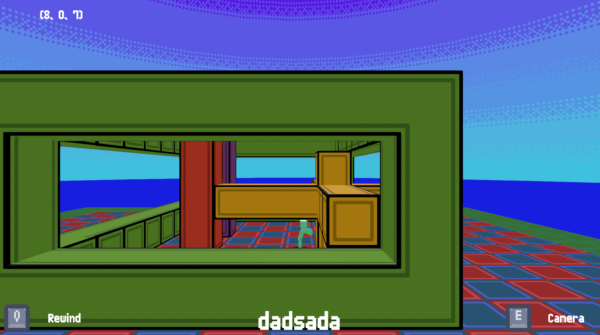</td>
</tr>

<tr>
<td style="text-align:center;">All levels in the Steam and Switch version are pull levels. Built via a pixel art level editor. Blocks can be pulled out to different degrees and climbed on.</td>
<td style="text-align:center; border-left:2px solid;">New level type for the cancelled sequel. Built via a pixel art level editor. Blocks have gravity and can be pushed and pulled in 3D space. Blocks are only 1 unit thick (except when special modifier are used).</td>
<td style="text-align:center; border-left:2px solid">New level type for cancelled sequel. Same as 2D Crash levels except they are built with a 3D level editor, which allows you to build voxel levels.</td>
</tr>

<tr>
<td style="text-align:center">Fully implemented. 100% functional with different level types and special blocks. Only minor inconsistent collision glitches that I have rarely witnessed but not been able to replicate</td>
<td style="text-align:center; border-left:2px solid">Partially implemented. ~70% functional with a bunch of glitches. Some special blocks implemented. Core gameplay works.</td>
<td style="text-align:center; border-left:2px solid">Partially implemented. ~30% functional with a bunch of glitches. No special blocks implemented. This is the last level type I was working on before dropping the project so it is glitchy</td>
</tr>

</table>

# How To Play/Build

1. Open the Project in Unity 2022.2.7f1

2. Open the scene titled "0-Open-PictoPull". This is the master scene which contains all of the game logic and menus. The other scenes in the project are basically just the 3D backgrounds that are loaded in based on the selected level.

3. Hit play button to ensure everything is working

4. The project is set up to use the [Multitarget Build System](https://github.com/voldien/UMultiTargetBuilder). I liked this system as it allowed me to easily manage and build multiple different build configurations at once, something not possible in older Unity versions by default. One side effect of this is that the default Unity build system WILL NOT WORK, you HAVE TO build via the Multitarget build system. This can now probably be replaced with Unity's improved build system if the project is upgraded to Unity 6. You can also remove the multitarget build system and then use the default build system with no issues.

5. To Build:

		- Go to "Edit->Project Settings->Multitarget Build Settings"
		- Choose an output directory
		- Create or select a build target
		- Press the "Build Targets" button

		
# Differences from released version
In order to open source the the project I have had to remove some artwork, code, and levels that I have the legal right to use in a game, but do not have the right to distribute as an open source project. I also removed some assets that could be legally distributed but require attribution, as I want to remove that and make the project require as little attribution as possible. Here is an example of the changed art style:

<table width="100%">
<tr><th style="text-align:center">Steam/Switch Version</th><th style="text-align:center">Open PictoPull</th></tr>
<tr><td>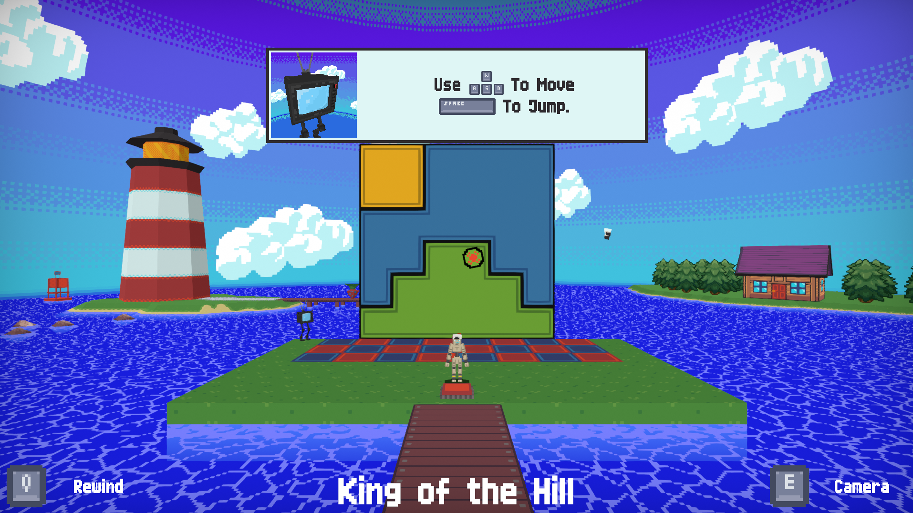</td><td>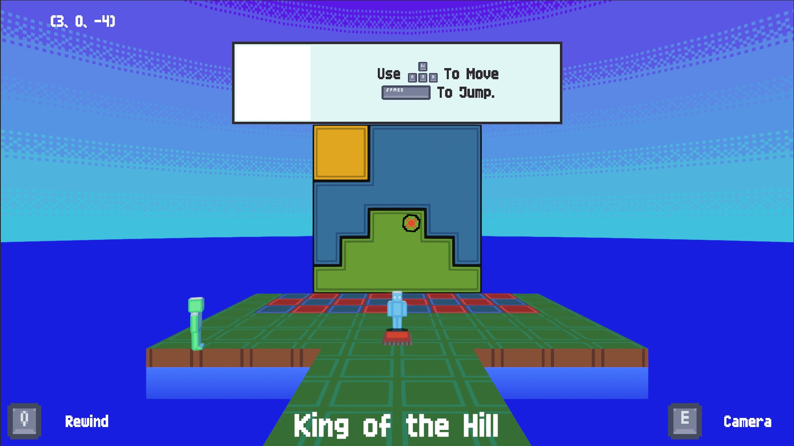</td></tr>
</table>

As you can see the art is now very barebones and is basically placeholder art. If anyone wants to make a commercial game out of this project they will most likely need to redo the character model and environmental art.

## Textures/Models for environments

In the original PictoPull the gameplay took place in 10 different 3D environments which mainly served as functionless backgrounds for the gameplay. Some of those backgrounds were built with third party assets, textures, and models that I cannot distribute/open source. I have removed all non distributable third party textures/models from the game. This means many of the environments are currently broken and glitchy looking. I have changed the games data files so that instead of loading these old broken environments a simple mostly empty environment is now loaded.

<table width="100%">
<tr><th style="text-align:center">Steam/Switch Version</th><th style="text-align:center">Open PictoPull</th></tr>
<tr><td>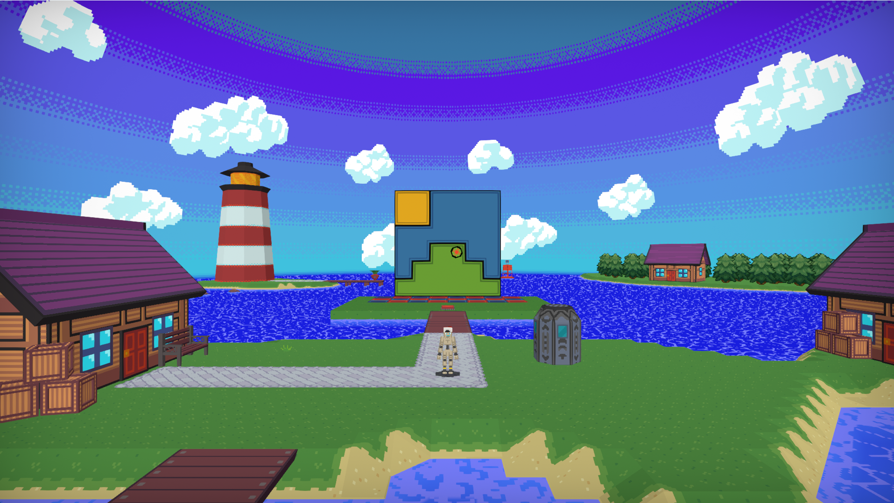</td><td>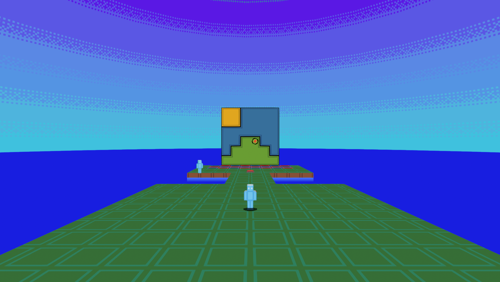</td></tr>
</table>

## Character Model

The character model for the original game was [Walking Robot Guy](https://sketchfab.com/3d-models/walking-robot-guy-blockbench-animation-7190ff66cb3d4e729a2ab95aeb9e797f). I never liked this model so I replaced this model with the base Blockbench humanoid 3D Model.

<table width="100%">
<tr><th style="text-align:center">Old Model</th><th style="text-align:center">New Model</th></tr>
<tr><td>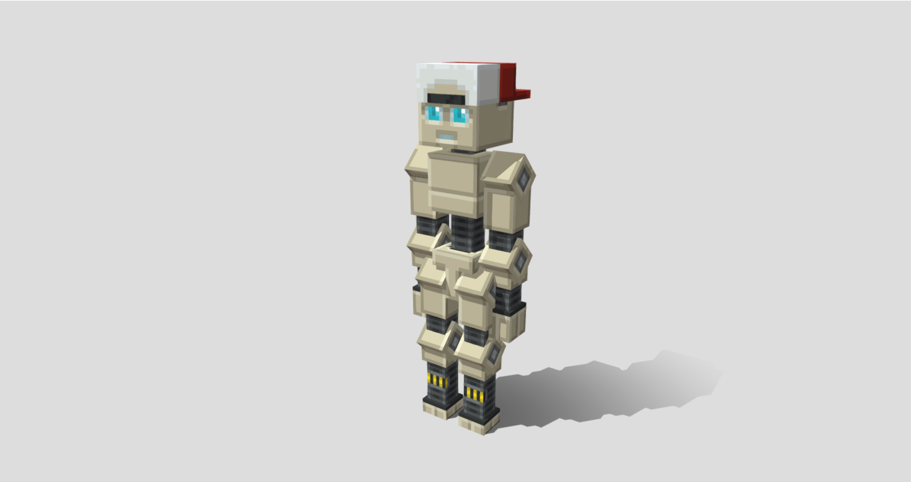</td><td>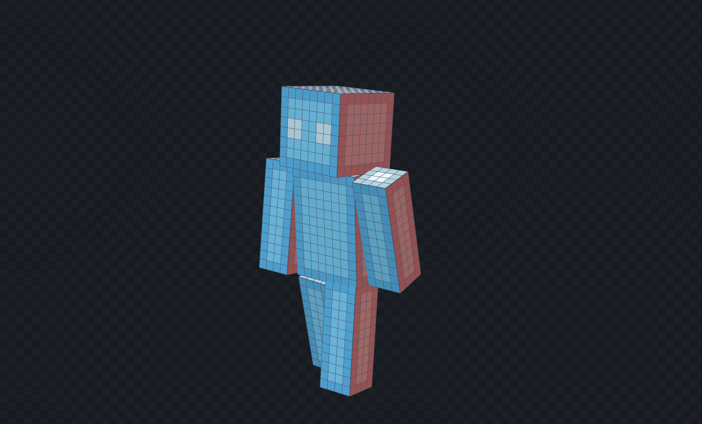</td></tr>
</table>

## Steam Workshop Support

Unfortunately the steam workshop integration for the Steam version of PictoPull was made with a third party asset [Steam Workshop - Easy Steamworks Integration](https://assetstore.unity.com/packages/tools/integration/steam-workshop-easy-steamworks-integration-86189) I have removed this asset from the project. It will have to be re implemented if you want Steam workshop support.

## Certain levels removed

Certain levels from PictoPull were based on pixel art assets packs I had bought. I had the right to use them as levels but I cannot distribute the artwork as an open source project. These levels have been removed. It is only ~10 levels out of 100+.

# Tools/Assets Used

- [Unity Game Engine](https://unity.com/) - Game engine used
- [Blockbench](https://www.blockbench.net/) - Used to make and texture 3D models in a low poly pixel art style
- [Blender](https://www.blender.org/) - Used to make and edit 3D models
- [Aseprite](https://www.aseprite.org/) - Pixel art editor used to make textures/levels
- [HSV Color Picker](https://github.com/judah4/HSV-Color-Picker-Unity) - Open source color picker prefab used for the level editor
- [Simple File Browser](https://github.com/yasirkula/UnitySimpleFileBrowser) - Open source file browser system used for the level editor
- [Steamworks.NET](https://github.com/rlabrecque/Steamworks.NET) - C# Steamworks implementation used for steam achievements
- [Multitarget Build System](https://github.com/voldien/UMultiTargetBuilder) - Open source build system
- [Kenney Input Promps Pixel 16x](https://kenney.nl/assets/input-prompts-pixel-16) - Pixel art icons used for controller icons

# Sounds

Music by Tahir Rogers

SFX from [Kenney](https://kenney.nl/) and [Liu Jiajun](https://opengameart.org/content/95-sfx-pack-beats-warrior-nian)

